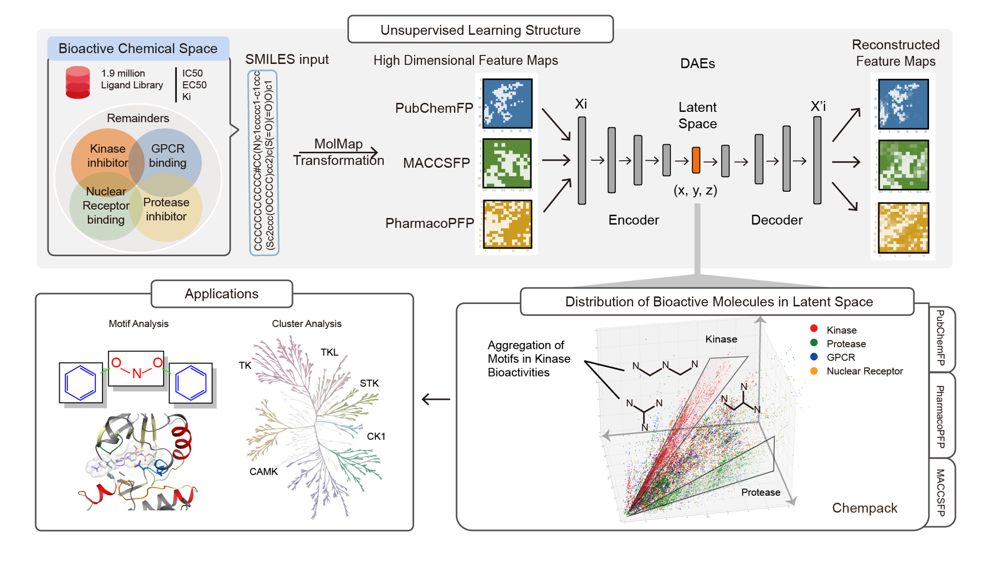
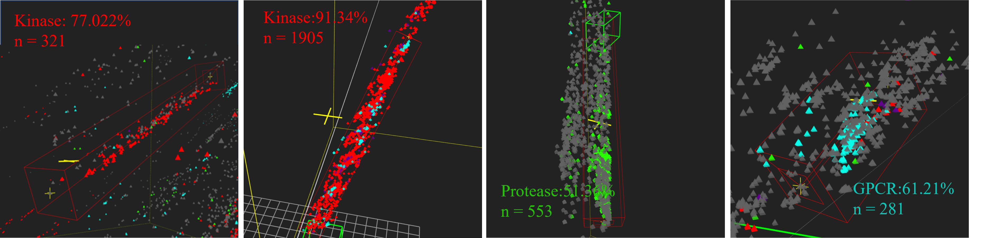

# MolF-DAEs
## Molecular-substructure deep autoencoders cluster biomolecules into novel substructure-distinguished bioactivity-relevant band-shaped clusters in three-dimensional latent space


😄Note! This repository is theoretically suitable for 3D clustering and undistorted visualization of any one-hot encoded high-dimensional data. 




### Introduction


This repository is for reproducing the data processing steps in MolF-DAEs, extracting (x,y,z) coordinates and clustering visualization for customized datasets. 

Chempack is a self-developed high-quality large sample 3D imaging software: https://github...

The example provided here is three sets of 1.9 million molecular fingerprint vectors. Labels including experimental varified target types in ChEMBL.

### 1. Requirement

For molecular dataset, first you need to install the relative packages to run MolMapNet. 
Please see https://github.com/shenwanxiang/bidd-molmap for details.

```
cuda                11.2
python              3.6.15
numpy               1.19.5
pandas              1.1.5
rdkit               2021.03.5
tensorflow-gpu      2.9.1
scikit-learn        0.24
```

or Clone the current repo.

    git clone https://github.com/../molf-daes.git
    conda env create -f environment.yml

___
### 2. Training with 3D-DAEs
Here you can replace with your dataset. Features will be first flattened into one-dimensional vectors.
####    1. Generate molecular fingerprint data
* [Example for Molecular Fingerprint Feature Maps based on MolMap.](./code/feature_extraction.ipynb)


```py
import molmap

metric = 'cosine'
method = 'umap'
n_neighbors = 30
min_dist = 0.1
mp_name = 'fingerprint.mp'

bitsinfo = molmap.feature.fingerprint.Extraction().bitsinfo
flist = bitsinfo[bitsinfo.Subtypes.isin(['MACCSFP'])].IDs.tolist() #    replace with FMAP channel
mp2 = molmap.MolMap(ftype = 'fingerprint', metric = metric, flist = flist)
mp2.fit(method = method, n_neighbors = n_neighbors, min_dist = min_dist)
mp2.save(mp_name) ## save it as a featurizer

#replace with your molecule SMILES list.
smiles1 = 'CC(=O)OC1=CC=CC=C1C(O)=O' #aspirin
smiles2 = 'CC(=O)NC1=CC=CC=C1C(O)=O' #N‐acetylanthranilic acid
X1 = mp2.batch_transform([smiles1, smiles2])
dump(X2, '../dataset/test_chembl.data2')
```

####    2. Training of molecular fingerprint data
* [Example for PubChemFP MolF-DAEs.](https://github.com/...test1_best.ipynb)
* [Example for MACCSFP MolF-DAEs.](https://github.com/.../test9_1_best.ipynb)
* [Example for PharmacoPFP MolF-DAEs.](https://github.com/.../test1_1_best.ipynb)

```py
import sys
from model import create_and_train_model, encode_data
from joblib import load, dump
import matplotlib.pyplot as plt
import pandas as pd

sys.path.append('../') 
X1 = load('../dataset/test_chembl.data2')

model, history1, history2 = create_and_train_model(X1)

pd.DataFrame(history1.history).plot()
pd.DataFrame(history2.history).plot()

y_pre = model.predict(X1[:10])

fig = plt.figure(figsize=(20,8))
for i in range(10):
    ax = plt.subplot(2,5,i+1)
    ax.imshow(X1[i])

fig = plt.figure(figsize=(20,8))
for i in range(10):
    ax = plt.subplot(2,5,i+1)
    ax.imshow(y_pre[i])

model.save('../model/pubchem_test_1_model_best')

X3 = encode_data(model, X1[:200000])
dump(X3, '../result/pubchemfp/test1_best_pubchem/1-200000')

```
------

### 3. Visualization of Molecular Coordinate Mapping
Generate standard coordinate files and label files adapted to Chempack. 



####    1. MolF-DAEs into 3D Space.
Coordinate Generation and Label Generation.

```py
import os
X3 = load('../result/comparison/PCA/2-pca/1-200000')
df1 = pd.DataFrame(X3, columns=list('XYZ'))
df.to_csv('../result/comparison/PCA/PCA_2_ME.csv')
data = pd.read_csv('/raid/wx_home/learning/2_190w_model_new/pubchem_experiment_compari/UMAP_2/UMAP_2_ME.csv', encoding='utf-8')
with open('/raid/wx_home/learning/2_190w_model_new/pubchem_experiment_compari/UMAP_2/UMAP_2_190w_3d_data3.txt','a+', encoding='utf-8') as f:
    for line in data.values:
        f.write((str(line[1])+'\t'+str(line[2])+'\t'+str(line[3])+'\n')) 
```

This method produces files in formation that can be put directly into ChemPack software for visualisation. The extraction method is described in Software. 

####    2. 128-Dimension Feature from PubChemFP DAEs with PCA/UMAP visualization.
* [Example for DAEs & PCA](https://github.com/../code/PCA.ipynb)
* [Example for UMAP & DAEs](https://github.com/../code/UMAP.ipynb)
